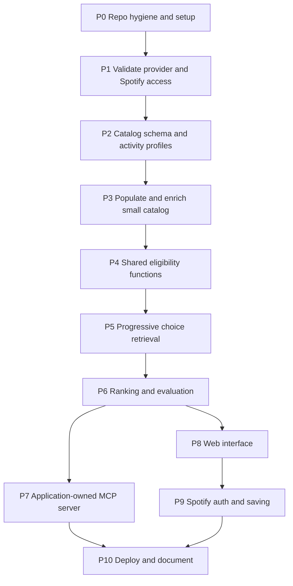

# Developer Sequence Flow

Tracks the build of the system defined in `lyric_recommendation_specification.md` (referred to below as **Spec**). This file is the work plan; the Spec is the source of truth for behavior. If they disagree, update the Spec first, then this file.

## How to use this file

- Work the phases in order. A phase starts only when every phase it **depends on** is done.
- Each task has an ID (`P3.2` = phase 3, task 2). Reference IDs in commit messages and branch names (for example `p3.2-enrichment-job`).
- Mark progress by changing the checkbox:
  - `[ ]` not started · `[~]` in progress · `[x]` done · `[-]` dropped (add a one-line reason)
- A task is done only when its **Done when** condition holds, not when the code is written.
- Tasks marked **DECISION** produce a recorded choice, not code. Record the outcome in the [Decision log](#decision-log).
- Tasks marked **PROVISIONAL** set tunable values. Record them in configuration with `status: provisional` and a rationale (Spec §11).

## Sequence at a glance

P7 and P8 both consume the shared backend and can run in parallel once P6 is done.

## Progress summary

| Phase | Title | Depends on | Status |
| --- | --- | --- | --- |
| P0 | Repo hygiene and setup | — | in progress |
| P1 | Validate provider and Spotify access | P0 | not started |
| P2 | Catalog schema and activity profiles | P1 | not started |
| P3 | Populate and enrich small catalog | P2 | not started |
| P4 | Shared eligibility functions | P3 | not started |
| P5 | Progressive choice retrieval | P4 | not started |
| P6 | Ranking and evaluation | P5 | not started |
| P7 | Application-owned MCP server | P6 | not started |
| P8 | Web interface | P6 | not started |
| P9 | Spotify auth and saving | P8 | not started |
| P10 | Deploy and document | P7, P9 | not started |

---

## P0 — Repo hygiene and setup

**Goal:** a clean, safe repository to build in.

- [x] **P0.1** Add `.env` and `audio-feats-mcp.json` to `.gitignore`.
  - Done when: `git check-ignore` lists both files.
- [-] **P0.2** Rotate the RapidAPI key. Handled by the repo owner outside this plan.
- [ ] **P0.3** Commit a key-free template such as `audio-feats-mcp.example.json`, with a placeholder for the key.
  - Done when: a fresh clone can be configured from the template without anyone sharing a file.
- [x] **P0.4** Keep draft Python files out of the repo: `*.py` and `graph.png` are in `.gitignore`. `app_draft.py` stays a local draft only; it calls related-artist and artist-top-track endpoints at request time, which the Spec excludes (Spec §1.1, §9.5, §10.3), so do not port that logic.
- [x] **P0.5** Publish the revamp on the existing repo: branch `feat/revamp` of `pablobagano/spotify`, with the old clustering-project files removed (they remain in `main`'s history).
- [ ] **P0.6** Narrow the `*.py` ignore rule before writing real code. Replace it with rules for specific draft files, or move drafts to an ignored `drafts/` folder.
  - Done when: `git check-ignore src/spotify_app/__init__.py` prints nothing and the drafts are still ignored.
- [ ] **P0.7** Lay out the package skeleton under `src/spotify_app/`: `catalog/` (schema, DB access), `enrichment/` (offline jobs), `backend/` (eligibility, choices, ranking), `interfaces/mcp/`, `interfaces/web/`, `config/`. Add `tests/`.
  - Depends on: P0.6.
  - Done when: `uv run pytest` runs (even with zero tests).
- [ ] **P0.8** Add dev tooling (test runner, formatter or linter) to `pyproject.toml`; fill in the project description.

---

## P1 — Validate external provider coverage and Spotify access

**Goal:** know what the dependencies actually support before building on them (Spec §5, §10.3, §12 step 1).
**Depends on:** P0

### P1-A Audio-feature provider (through its MCP client)
- [ ] **P1.1** Connect to the provider's MCP server from a scratch script or MCP client; list its tools and their input/output schemas.
  - Done when: the tool names and parameters are recorded in `docs/provider_notes.md`.
- [ ] **P1.2** Choose 20–30 representative recordings across the intended activities and genres, including edge cases (remasters, live versions, collaborations, instrumentals, very slow and very fast tracks).
- [ ] **P1.3** Fetch features for that sample and record coverage: found, not found, and partial (some fields missing).
- [ ] **P1.4** Spot-check accuracy: does the returned ID/URI match the request, and are values plausible (bounded fields within the expected range, tempo half or double time)?
- [ ] **P1.5** Determine and record request granularity (one track or several per call), observed limits and errors, and the provider's terms on caching and storing responses. Do not assume anything not observed or documented.
- [ ] **P1.6** **DECISION** Is provider coverage good enough for the demo? If not, decide on the fallback (narrower catalog or manual curation of missing tracks).
  - Done when: the decision is in the Decision log with the coverage numbers.

### P1-B Spotify access
- [ ] **P1.7** Register or confirm the Spotify app; record its mode (Development or Extended), the Premium requirement, and the user allow-list limit (Spec §10.3).
- [ ] **P1.8** Verify a client-credentials token can call Search (needed for offline ID resolution).
- [ ] **P1.9** Verify with a test account that `POST /v1/me/playlists` and `POST /v1/playlists/{id}/items` work under the current rules.
- [ ] **P1.10** **DECISION** What does the public demo promise about saving (allow-listed users only, or preview only)?

**Phase done when:** `docs/provider_notes.md` holds the coverage sample and provider capabilities, and the Spotify constraints are confirmed in the Decision log.

---

## P2 — Catalog schema and configurable activity profiles

**Goal:** the data model and configuration format, with load-time validation (Spec §4, §6, §11).
**Depends on:** P1

### P2-A Storage
- [ ] **P2.1** **DECISION** Choose the database (a single-file relational database is enough for a small catalog; the Spec requires relational, with JSON for vectors).
- [ ] **P2.2** Implement the schema: `genres`, `artists`, `artist_genres`, `tracks`, `track_artists` (with `is_primary`), `track_genres`, `lyric_excerpts` (with `enabled`), `track_profiles`, `track_audio_features` (nullable per-feature columns plus validation map and provenance), `enrichment_runs`.
- [ ] **P2.3** Add migrations or a repeatable schema-creation command.
- [ ] **P2.4** Tests: missing features are stored as NULL; constraints and foreign keys hold.

### P2-B Configuration
- [ ] **P2.5** **DECISION** Choose where config lives (version-controlled file or config table). Spec §4 allows either.
- [ ] **P2.6** Define the config format for activity profiles (Spec §6.1), normalization (§5.4), ranking weights and diversity (§9), each with a version string.
- [ ] **P2.7** Implement config loading with validation:
  - every constraint declares `scale: raw | normalized`
  - `min <= max`; one-sided ranges allowed
  - only supported features (energy, danceability, acousticness, instrumentalness, speechiness, valence, tempo)
  - `on_missing` is `exclude` unless a documented fallback with a rationale is given
  - every profile has `status` and `rationale`
- [ ] **P2.8** Tests: each invalid config case above is rejected with a clear error.
- [ ] **P2.9** **PROVISIONAL** Write initial profiles for each supported activity: chosen features, placeholder ranges, rationale. No values are presented as validated.
- [ ] **P2.10** **PROVISIONAL** Set `min_genre_tracks`, the tempo normalization range, and default and maximum playlist length.

**Phase done when:** the schema is created from scratch by one command, and invalid configurations fail to load in tests.

---

## P3 — Populate and enrich a small cached catalog

**Goal:** a small, fully enriched catalog that the backend can use offline (Spec §3, §5).
**Depends on:** P2

### P3-A Catalog seeding
- [ ] **P3.1** Define the initial curated list: activities × genres × artists, with enough tracks per path to test narrowing (record the target count).
- [ ] **P3.2** Implement Spotify ID resolution through Search; verify recording/version, not only title. Store track ID, URI, release year, recording version.
- [ ] **P3.3** Populate genres, artists, credits (primary flag), and track-genre classification.
  - Done when: every track has a verified Spotify ID and at least one genre.

### P3-B Audio-feature enrichment job
- [ ] **P3.4** Implement the enrichment job against the provider's MCP client using the request pattern recorded in P1.5.
- [ ] **P3.5** Make it resumable and idempotent: skip tracks with a valid record unless refresh is explicitly requested; write an `enrichment_runs` row per run.
- [ ] **P3.6** Implement validation (Spec §5.2): ID match, numeric and in range, per-feature `valid` / `missing` / `rejected` status with reason, record-level status; flag suspicious tempo without correcting it.
- [ ] **P3.7** Store provenance: provider, interface (tool name), `acquired_at`, run ID; store the raw response only if P1.5 confirmed storage is permitted.
- [ ] **P3.8** Tests with recorded fixtures: complete, partial, failed, mismatched-ID, and out-of-range responses. No test hits the live provider.
- [ ] **P3.9** Run enrichment on the catalog; produce a coverage report (per feature, per activity/genre path).

### P3-C Text, mood, and embeddings
- [ ] **P3.10** Curate lyric excerpts with attribution and source references, from permitted sources.
- [ ] **P3.11** Write semantic descriptions and mood scores per candidate track.
- [ ] **P3.12** **PROVISIONAL** Assign soft `activity_scores` per track (separate from hard eligibility, Spec §6.4).
- [ ] **P3.13** **DECISION** Choose the embedding model/version.
- [ ] **P3.14** Compute embeddings for excerpts and track descriptions with the same model/version; store the version.

**Phase done when:** the catalog loads with valid IDs and provenance, missing features are NULL, and the coverage report shows enough candidates per intended path or lists the gaps.

---

## P4 — Shared eligibility functions

**Goal:** hard activity eligibility, computed by the backend from the database only (Spec §6).
**Depends on:** P3

- [ ] **P4.1** Implement normalization using the versioned parameters (bounded features direct, tempo clipped to the configured range).
- [ ] **P4.2** Implement the constraint check: inclusive bounds, one-sided ranges, `raw` vs `normalized` comparison.
- [ ] **P4.3** Implement missing-feature handling: NULL or `rejected` → ineligible under `exclude`; apply only declared fallbacks and count them.
- [ ] **P4.4** Implement `P_activity` (enabled + all constraints) and `P_genre` pool builders, returning counts including exclusions for missing features.
- [ ] **P4.5** Acceptance tests — activity boundaries (Spec §13):
  - value equal to `min` or `max` is eligible; just outside is not
  - one-sided ranges filter one side only
  - unconstrained features never exclude
  - raw tempo compared in BPM; normalized compared against pinned version
- [ ] **P4.6** Acceptance tests — missing required features (Spec §13): exclusion by default, fallback counted, no code path computes missing as 0.
- [ ] **P4.7** Test: eligibility runs with no network access (provider and Spotify unreachable).

**Phase done when:** all P4 acceptance tests pass.

---

## P5 — Progressive choice retrieval

**Goal:** choices computed from actual eligible tracks (Spec §7, §8).
**Depends on:** P4

- [ ] **P5.1** Define the structured error model: code, message, field. Codes: unknown activity, genre not eligible, artist not eligible, excerpt not eligible, seed unknown/disabled, invalid requested length, empty pool.
- [ ] **P5.2** Implement `get_eligible_genres(activity)`: genres with ≥ `min_genre_tracks` in `P_activity`, with counts.
- [ ] **P5.3** Implement `get_eligible_artists(activity, genre)`: artists credited on tracks in `P_genre`, with counts.
- [ ] **P5.4** Implement `get_eligible_excerpts(activity, genre, artist_ids)`: enabled excerpts whose parent track is in `P_genre`; selected-artist excerpts first and flagged.
- [ ] **P5.5** Implement a selection-reconciliation helper: given changed earlier selections, return which downstream selections are kept and which are cleared, with the reason.
- [ ] **P5.6** Acceptance tests — empty pools: activity with no eligible tracks not offered; genre below threshold not offered; structured errors returned.
- [ ] **P5.7** Acceptance tests — downstream resets: activity change keeps still-valid selections and clears invalid ones; genre change clears artists/excerpts with no eligible tracks; offered counts match recomputed pools.

**Phase done when:** all P5 acceptance tests pass.

---

## P6 — Ranking and evaluation

**Goal:** `generate_playlist` preview with explainable, deterministic ranking (Spec §9).
**Depends on:** P5

### P6-A Implementation
- [ ] **P6.1** Validate all selections again (stale selections → structured error naming the field).
- [ ] **P6.2** Build the seed profile: default seed = excerpt's parent track; explicit seeds averaged per dimension over seeds that have it (equal weights by default); seeds must be known and enabled but need not be in the pool.
- [ ] **P6.3** Implement the components on [0, 1]: mood (embedding cosine mapped to [0, 1], tag fallback flagged), activity (soft score), audio (1 − weighted mean absolute distance), artist, genre.
- [ ] **P6.4** Implement missing-feature renormalization in audio similarity, and omission of the audio component when no dimension is usable; report evidence coverage.
- [ ] **P6.5** Combine with the versioned weights; drop and renormalize the genre weight under the strict genre filter.
- [ ] **P6.6** Sort with a stable track-ID tie-breaker.
- [ ] **P6.7** Apply diversity (primary-artist limit, no duplicate recording/version) during selection; return a shortfall notice instead of relaxing limits.
- [ ] **P6.8** Build the preview response: ordered IDs and URIs, component scores, short score-grounded explanations, evidence coverage, shortfall notice, pool count, config versions.

### P6-B Acceptance tests
- [ ] **P6.9** Small pools: fewer tracks with a shortfall notice; no range widening, no genre switch, no diversity relaxation.
- [ ] **P6.10** Preferred artists: not restricted to selected artists; artist component applied; diversity limit still applies.
- [ ] **P6.11** Multiple seeds: default single seed; per-dimension averaging; out-of-pool seeds influence but aren't forced in; unknown or disabled seed → error.
- [ ] **P6.12** Determinism: identical inputs return identical output.
- [ ] **P6.13** Separation: no provider or Spotify call during generation.

### P6-C Evaluation
- [ ] **P6.14** Run scenarios: work, workout, relaxation, conflicting mood and activity (for example a melancholic seed for workout), multiple contrasting seeds, sparse pools.
- [ ] **P6.15** Review results; adjust **PROVISIONAL** ranges and weights deliberately; record each change and the reason in the Decision log; promote profiles to `status: evaluated` only after review.

**Phase done when:** P6 acceptance tests pass and the evaluation notes are recorded.

---

## P7 — Application-owned MCP server

**Goal:** an agent-facing interface over the same backend (Spec §8). Separate from the provider's MCP server.
**Depends on:** P6 (can run in parallel with P8)

- [ ] **P7.1** Set up the MCP server inside `interfaces/mcp/`, with no provider or Spotify credentials in its environment.
- [ ] **P7.2** Expose `get_eligible_genres`, `get_eligible_artists`, `get_eligible_excerpts`, `generate_playlist` as tools; each validates arguments and delegates to the shared function, with no logic of its own.
- [ ] **P7.3** Map backend structured errors to MCP tool errors unchanged (same code and field).
- [ ] **P7.4** Write tool descriptions that say `generate_playlist` returns a preview and never saves to Spotify.
- [ ] **P7.5** Acceptance tests — consistency: for identical inputs and catalog/config versions, each tool returns the same IDs, order, counts, scores, and errors as the direct function call.
- [ ] **P7.6** Test: no Spotify write is reachable through MCP.
- [ ] **P7.7** Manual check: connect an MCP client and walk activity → genre → artists → excerpt → preview.

**Phase done when:** P7 tests pass and the manual walkthrough works.

---

## P8 — Web interface

**Goal:** the user-facing app on the same backend functions (Spec §2, §7).
**Depends on:** P6 (can run in parallel with P7)

- [ ] **P8.1** **DECISION** Choose the web framework and hosting target.
- [ ] **P8.2** Build the step flow in order: activity → genre → artists → excerpt → generate → preview, calling the shared functions directly.
- [ ] **P8.3** Show the eligible track count with each option.
- [ ] **P8.4** On changing an earlier step, apply reconciliation (P5.5) and tell the user which later selections were cleared.
- [ ] **P8.5** Optional seed-track selection (multiple).
- [ ] **P8.6** Preview: ordered tracks, explanations, evidence coverage, shortfall notice with a prompt to broaden a named selection.
- [ ] **P8.7** Error and empty states for every structured error code.
- [ ] **P8.8** Test with the provider and Spotify unreachable: every selectable path produces a valid preview or a clear insufficient-catalog message.

**Phase done when:** P8.8 passes across all selectable paths.

---

## P9 — Spotify authentication and playlist saving

**Goal:** optional save of the previewed playlist (Spec §10.2).
**Depends on:** P8

- [ ] **P9.1** Implement Authorization Code with PKCE, triggered only by Save to Spotify; validate `state`.
- [ ] **P9.2** Request `playlist-modify-private` only (public scope only if public saving becomes a feature).
- [ ] **P9.3** Create the playlist (`POST /v1/me/playlists`, `public: false`).
- [ ] **P9.4** Add the previewed URIs in preview order (`POST /v1/playlists/{playlist_id}/items`).
- [ ] **P9.5** Handle partial writes (report what was added; allow retry of the remainder).
- [ ] **P9.6** Prevent duplicate playlists from repeated submissions (idempotency per preview).
- [ ] **P9.7** Keep secrets server-side; protect or avoid retaining user tokens.
- [ ] **P9.8** Show clear messaging for users outside the allowed Development Mode list (per P1.10).
- [ ] **P9.9** Test with an allow-listed account: the saved playlist opens in Spotify in the same order as the preview.

**Phase done when:** P9.9 passes and partial-failure and duplicate cases are handled.

---

## P10 — Deploy and document

**Goal:** a public portfolio demo that states its limits honestly.
**Depends on:** P7, P9

- [ ] **P10.1** Configure production secrets through the host's environment, not files.
- [ ] **P10.2** Deploy the web app; confirm the public preview works without login.
- [ ] **P10.3** Decide whether and how to expose the MCP server publicly (or document local use only).
- [ ] **P10.4** README: what the app does, architecture (three layers), how to run locally, how to run enrichment.
- [ ] **P10.5** Document catalog coverage (from P3.9), activity profiles and their provisional or evaluated status, ranking approach, and example results.
- [ ] **P10.6** Document limitations: catalog-bounded coverage, provider dependency, Spotify saving restrictions.
- [ ] **P10.7** Final check that saving behavior described in the app matches permitted access.

**Phase done when:** the deployed preview works and the documentation matches observed behavior.

---

## Decision log

Record every **DECISION** and every change to a **PROVISIONAL** value.

| Date | Task | Decision | Reason / evidence |
| --- | --- | --- | --- |
| 2026-10-03 | P0.1 | Ignore `.env` and `audio-feats-mcp.json` in git | Both hold credentials |
| 2026-10-03 | P0.4 | Ignore all `*.py` files and `graph.png` for now | Current Python files are drafts; the repo starts clean |
| 2026-10-03 | P0.5 | Revamp on branch `feat/revamp` of `pablobagano/spotify`; delete old files on the branch | Reuse the existing repo; old project stays in `main` history |
| | P1.6 | Provider coverage sufficient? | |
| | P1.10 | Public saving promise | |
| | P2.1 | Database | |
| | P2.5 | Config location | |
| | P3.13 | Embedding model/version | |
| | P8.1 | Web framework and hosting | |

## Open questions carried from the Spec

These need answers during the phases noted; they are not blockers to starting P0–P1.

- Activity ranges and rationale per activity — P2.9, revisited in P6.15.
- Acceptable `on_missing` fallbacks, if any — P2.9.
- `min_genre_tracks`, tempo normalization range, default and maximum playlist length — P2.10.
- Per-feature audio weights — P6.15.
- Provider request granularity, limits, storage terms — P1.5.
